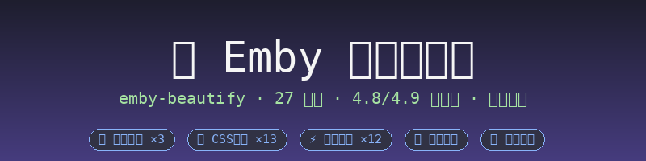
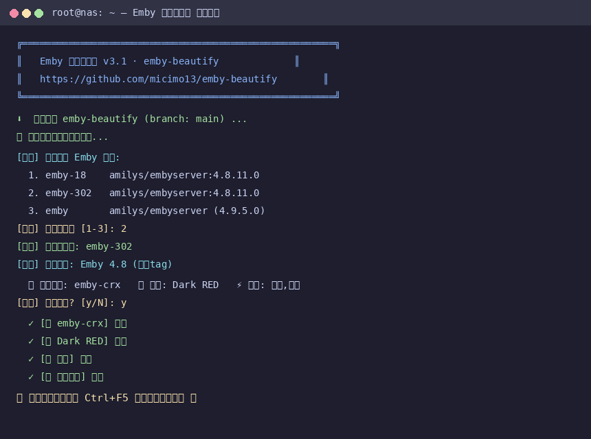
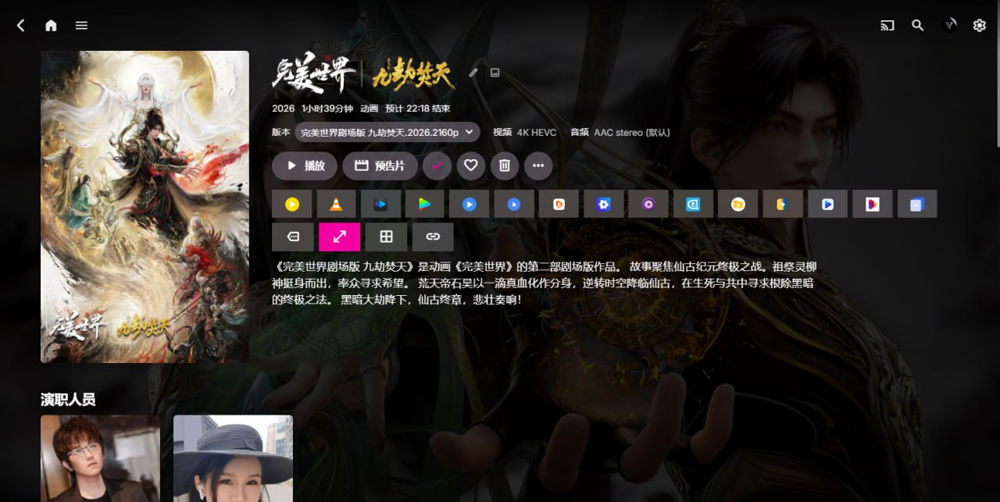
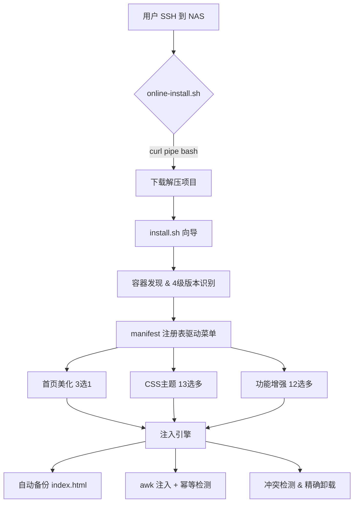

<p align="center">
  
</p>

# 🎨 Emby 美化全家桶 · emby-beautify

> **让每一台 Emby，都成为艺术品。**
> 一个命令，27 个组件自由组合，自动适配 Emby 4.8 / 4.9。

<p align="center">
  <a href="https://github.com/micimo13/emby-beautify/stargazers"></a>
  <a href="https://github.com/micimo13/emby-beautify/blob/main/LICENSE"></a>
  
  
</p>

---

## ✨ 它是什么？

**emby-beautify** 是一个面向自建媒体库爱好者的 **Emby 前端美化工具箱**。无论你的 Emby 跑在群晖、威联通、飞牛、UNRAID 还是任何 Linux 服务器上，只需一行命令，就能：

- 🎬 换上**沉浸式首页轮播**（4.8 / 4.9 自动适配）
- 🎭 一键应用 **13 款 CSS 主题**（极简 / 暗黑 / 毛玻璃 / 自研风格）
- ⚡ 叠加 **12 个功能增强**（弹幕 / 豆瓣评分 / 倍速 / 剧照 / JAV 元数据…）
- 🛡️ **自动备份 + 幂等安装 + 精确卸载**，随时可还原

> 💡 官方镜像（`emby/embyserver` 或 `linuxserver/emby`）与第三方镜像均可使用——脚本自动探测容器内的 Web 目录，无需关心镜像差异。

---

## 🚀 30 秒上手

```bash
# 交互式完整向导（推荐）
curl -sL https://raw.githubusercontent.com/micimo13/emby-beautify/main/scripts/online-install.sh | bash

# 零交互快速安装（自动识别版本+推荐配置）
curl -sL https://raw.githubusercontent.com/micimo13/emby-beautify/main/scripts/online-install.sh | bash -s -- --quick

# 指定容器 + 指定组件
curl -sL https://raw.githubusercontent.com/micimo13/emby-beautify/main/scripts/online-install.sh | bash -s -- --container emby --feature danmaku
```

安装完成后，浏览器 **Ctrl+F5 / Cmd+Shift+R** 强制刷新即可看到效果 ✨

<p align="center">
  
  <br/><em>↑ 真实安装过程演示</em>
</p>

---

## 🧩 组件全家桶（27 个）

### 🎬 首页美化（按版本自动推荐，三选一）
| 组件 | 适配 | 效果 | 来源 |
|------|:---:|------|------|
| ✨ emby-home-beautify | 4.9 | 沉浸式轮播（最近添加/Backdrop/Logo/简介） | [开源](https://github.com/rockyzhao3000/emby-home-beautify) |
| 🎨 emby-crx | 4.8 | 加载动画 + Banner 轮播 + 媒体库悬浮 | [开源 ⭐1.2k](https://github.com/Nolovenodie/emby-crx) |
| 🪟 emby-fluent | 4.8 | Fluent 设计语言风格 | [开源](https://github.com/heichaowo/Emby-Fluent) |

### 🎭 CSS 主题（可叠加，全版本）
| 组件 | 效果 | 来源 |
|------|------|------|
| 🌿 Embymalism | 极简风 | [开源](https://github.com/v1rusnl/Embymalism) |
| 🔴🌸🟠🔵🟣🟢⚪ Dark×8 | 8 色暗黑主题 | [开源](https://github.com/BenZuser/Emby-Web-Dark-Themes-CSS) |
| 🍎 Apple Glass | 苹果毛玻璃 | [开源](https://github.com/michaelfried-dev/emby-apple-glass) |
| 🏴 Vanvy Dark / 📄 Vanvy Detail | 自研深色 / 详情页主题 | **Vanvy 自研** |

### ⚡ 功能增强（可多选，全版本）
| 组件 | 效果 | 来源 |
|------|------|------|
| 🔞 **JAV 元数据美化工程** | Javdb 刮削/番号识别/演员作品/翻译/预告片（独立大项，自动检测冲突） | [开源](https://github.com/XingyiHua2024/Emby-Javascript-Details) |
| 💬 弹幕 | B站/抖音等多源弹幕 | [开源 ⭐456](https://github.com/chen3861229/dd-danmaku) |
| ⭐ 豆瓣/Bangumi 评分 | 详情页评分展示 | [开源](https://github.com/kjtsune/embyToLocalPlayer) |
| 🖼️ 剧照展示 | 详情页高清剧照 | **Vanvy 自研** |
| ⏩ 播放倍速 | 快捷键倍速 | **Vanvy 自研** |
| 🌀 加载动画 | 首页加载动画+服务器名 | **Vanvy 自研** |
| 🔗 远程路径助手 | 显示远程资源路径可复制 | **Vanvy 自研** |
| 🎬 第三方播放器 | 调用 PotPlayer/mpv | **Vanvy 自研** |
| 📺 Banner 轮播 | 自定义 Banner 轮播 | **Vanvy 自研** |
| 📑 详情页 Tabs | 自定义详情页栏目 | **Vanvy 自研** |
| 🎞️ Trailer 增强 | 详情页预告片 | **Vanvy 自研** |
| 🎨 自定义 CSS 加载 | 按服务器加载 CSS | **Vanvy 自研** |

> 🏆 **Vanvy 自研** 组件：在真实 NAS 环境实战打磨的脚本，语义化命名、无广告、无追踪。

---

## 📸 真实效果展示

> 以下截图来自 **Vanvy 自研媒体库**（Emby 4.9 + emby-home-beautify 轮播 + 自定义主题）的真实运行效果。

### 🏠 首页轮播
<p align="center">
  
</p>

### 📄 作品详情页
<p align="center">
  
</p>

### 🎬 动漫分类列表页
<p align="center">
  
</p>

### 📺 剧集列表页
<p align="center">
  
</p>

### 🎞️ 动漫作品详情页
<p align="center">
  
</p>

### 🗂️ 动漫作品列表页
<p align="center">
  
</p>

---

### 🎨 整合开源项目效果（参考）

<p align="center">
  
  
</p>
<p align="center"><em>emby-crx 首页轮播（<a href="https://github.com/Nolovenodie/emby-crx">来源</a>）</em></p>

<p align="center">
  
  
</p>
<p align="center"><em>Embymalism 极简主题（<a href="https://github.com/v1rusnl/Embymalism">来源</a>）</em></p>

<p align="center">
  
</p>
<p align="center"><em>Dark Themes 暗黑系列（<a href="https://github.com/BenZuser/Emby-Web-Dark-Themes-CSS">来源</a>）</em></p>

---

## 🏗️ 技术架构



### ✨ 核心特性

| 特性 | 说明 |
|------|------|
| 🧬 **manifest 驱动** | 组件一行声明，菜单自动生成，新增组件不改脚本逻辑 |
| 🔍 **4 级版本识别** | 镜像tag → 容器内API → UI特征 → 手动选择 |
| 🔌 **自适应锚点注入** | 兼容 `</head>` 与 `<body>` 两种 HTML 结构（4.8/4.9 通吃） |
| 🛡️ **自动备份** | 每次注入前备份 index.html 到容器内 |
| ⚡ **幂等安装** | marker 检测，重复运行不重复注入 |
| 🔫 **冲突检测** | 详情页组/JAV/首页轮播自动互斥，避免样式打架 |
| 🧹 **精确卸载** | `--only <组件>` 只删指定组件，不误伤其他脚本 |
| 🌐 **在线安装** | 无需 clone，`curl | bash` 即用，支持代理镜像 |

---

## 🖥️ 完整命令参考

```bash
# 在线安装（交互式）
curl -sL https://raw.githubusercontent.com/micimo13/emby-beautify/main/scripts/online-install.sh | bash

# 快速模式（零交互）
curl -sL https://raw.githubusercontent.com/micimo13/emby-beautify/main/scripts/online-install.sh | bash -s -- --quick

# 指定容器（多 Emby 环境）
curl -sL https://raw.githubusercontent.com/micimo13/emby-beautify/main/scripts/online-install.sh | bash -s -- --container emby-18

# 直接安装指定组件（跳过交互）
curl -sL https://raw.githubusercontent.com/micimo13/emby-beautify/main/scripts/online-install.sh | bash -s -- --feature jav
curl -sL https://raw.githubusercontent.com/micimo13/emby-beautify/main/scripts/online-install.sh | bash -s -- --feature danmaku,douban

# 本地运行
git clone https://github.com/micimo13/emby-beautify.git
cd emby-beautify
bash install.sh              # 交互式
bash uninstall.sh --all      # 卸载全部
bash uninstall.sh --only jav # 只卸载 JAV 组件
```

---

## 🛠️ 开发者：新增组件

```bash
# 1. 资源放入 styles/ 或 features/<id>/
# 2. lib/manifest.sh 加一行声明：
#    "my_plugin|feature|📦 我的插件|all|描述|features/my_plugin|emby-my_plugin|<script src=\"emby-my_plugin/app.js\"></script>|emby-my_plugin/app.js|conflict_id1,conflict_id2"
# 3. ✅ 菜单自动出现，注入/卸载/冲突检测自动适配
```

---

## 🙏 致谢

整合的开源项目：
[emby-crx](https://github.com/Nolovenodie/emby-crx) · [dd-danmaku](https://github.com/chen3861229/dd-danmaku) · [Emby-Web-Dark-Themes-CSS](https://github.com/BenZuser/Emby-Web-Dark-Themes-CSS) · [embyToLocalPlayer](https://github.com/kjtsune/embyToLocalPlayer) · [Embymalism](https://github.com/v1rusnl/Embymalism) · [Emby-Javascript-Details](https://github.com/XingyiHua2024/Emby-Javascript-Details) · [Emby-Fluent](https://github.com/heichaowo/Emby-Fluent) · [emby-apple-glass](https://github.com/michaelfried-dev/emby-apple-glass) · [emby-home-beautify](https://github.com/rockyzhao3000/emby-home-beautify)

**Vanvy 自研**：stills / douban-score / playback-speed / loading-animation / remote-path / external-player / banner-carousel / detail-tabs / trailer-enhance / custom-css

---

## ⚠️ 说明

- 只修改容器内 Web UI 静态文件，不动媒体库/数据库/用户配置
- Emby 更新镜像后需重新运行安装脚本（自动备份保证可恢复）
- 页面定制不受 Emby 官方支持，升级前建议先在次要实例验证
- 弹幕/豆瓣/JAV 等功能依赖外网 API，容器需能访问外网

## 📄 License

MIT — 本项目代码与 Vanvy 自研脚本；内置开源项目遵循各自 License。

---

<p align="center">
  Made with ❤️ by <a href="https://github.com/micimo13">micimo13</a> · Vanvy 出品
</p>
