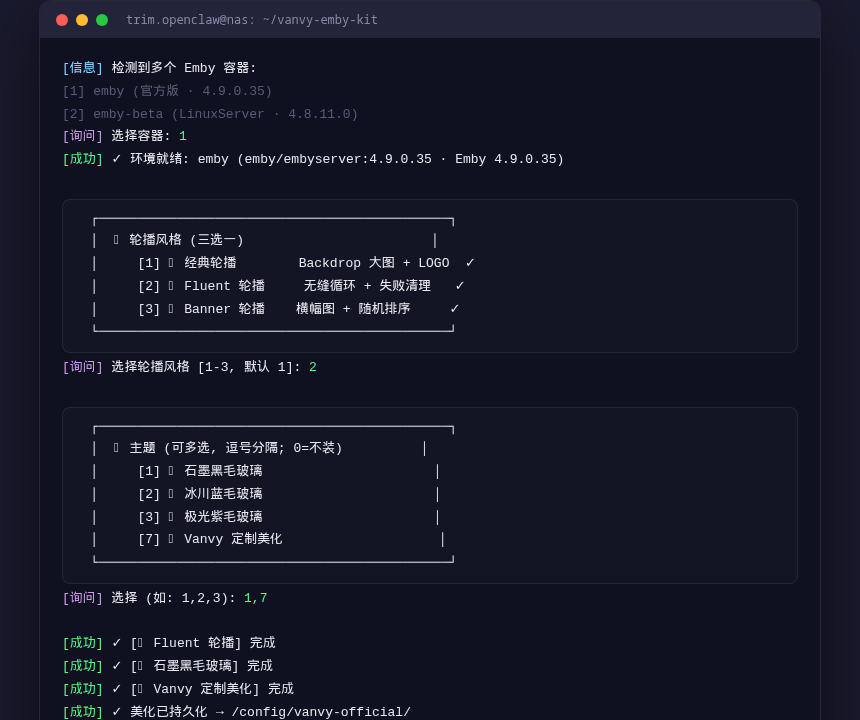

<p align="center">
  
</p>

# 🎨 Vanvy Emby Kit

> **让每一台 Emby，都成为艺术品。**
> 一行命令，自动识别你的 Emby 环境，自由组合美化组件。

<p align="center">
  <a href="https://github.com/micimo13/vanvy-emby-kit/stargazers"></a>
  <a href="https://github.com/micimo13/vanvy-emby-kit/blob/main/LICENSE"></a>
  
  
  
</p>

---

## ✨ 它是什么？

**Vanvy Emby Kit** 是一个面向自建媒体库爱好者的 **Emby 前端美化工具箱**。无论你的 Emby 跑在群晖、威联通、飞牛、UNRAID 还是任何 Linux 服务器上，只需一行命令，就能：

- 🎬 换上**沉浸式首页轮播**（经典 / Fluent / Banner 三选一）
- 🎨 一键应用 **7 款毛玻璃主题** + Vanvy 品牌定制
- ⚡ 叠加 **8 个功能增强**（弹幕 / 豆瓣评分 / 倍速 / 剧照 / JAV 元数据…）
- 🛡️ **自动识别镜像环境**，官方版 / LinuxServer / 社区版通吃
- 💾 **持久化存储**，容器重建后一键恢复

> 💡 自动探测容器内的 Web 目录与 Emby 版本，适配所有主流镜像布局，无需关心镜像差异。

---

## 📸 效果预览

> 以下截图来自真实媒体库运行环境（VANVY 定制 Emby）

### 🏠 首页推荐位

<p align="center">
  
  <br/>
  <em>沉浸式大图推荐位 + 毛玻璃信息层</em>
</p>

### 🎬 详情页与剧集列表

<p align="center">
  
  
  <br/>
  <em>详情页：高清海报 + 媒体信息 + 播放按钮</em>
</p>

<p align="center">
  
  
  <br/>
  <em>剧集列表：卡片式剧集 + 简介</em>
</p>

<p align="center">
  
  <br/>
  <em>剧集详情：分集信息 + 演职人员</em>
</p>

### 🖥️ 一键安装

<p align="center">
  
  <br/>
  <em>交互式向导：选容器 → 选轮播 → 选主题 → 完成</em>
</p>

---

## 🚀 30 秒上手

```bash
# 交互式完整向导（推荐，自动多源下载，国内可直连）
curl -sL https://gh-proxy.com/https://raw.githubusercontent.com/micimo13/vanvy-emby-kit/main/scripts/online-install.sh | bash

# 如果你能直接访问 GitHub，也可用官方地址
curl -sL https://raw.githubusercontent.com/micimo13/vanvy-emby-kit/main/scripts/online-install.sh | bash

# 零交互快速安装（全家桶）
curl -sL https://gh-proxy.com/https://raw.githubusercontent.com/micimo13/vanvy-emby-kit/main/scripts/online-install.sh | bash -s -- --package full --yes

# 指定容器 + 指定组件
curl -sL https://gh-proxy.com/https://raw.githubusercontent.com/micimo13/vanvy-emby-kit/main/scripts/online-install.sh | bash -s -- --container emby --feature danmaku
```

安装完成后，浏览器 **Ctrl+F5 / Cmd+Shift+R** 强制刷新即可看到效果 ✨

### 🛠️ 命令行详解

```bash
bash install.sh                          # 交互式向导
bash install.sh --container emby         # 指定容器
bash install.sh --package full --yes     # 全家桶免确认
bash install.sh --feature danmaku,douban # 只装指定组件
bash install.sh --restore                # 容器重建后恢复美化
bash install.sh --detect-only            # 只检测环境

bash uninstall.sh --container emby --all          # 卸载全部
bash uninstall.sh --container emby --only danmaku # 卸载单个组件
bash uninstall.sh --container emby --reset        # 完全还原出厂
```

### 💾 容器重建后恢复

- **官方版 / LinuxServer 版**：重建后运行一次 `bash install.sh --restore` 即可恢复全部美化
- **社区版（amilys 等）**：自动写入启动钩子，重建后自动恢复，无需手动操作

---

## 📦 组件包

| 包 | 包含组件 |
|---|---|
| 📦 **极简包** | 经典轮播 + Vanvy 品牌主题 |
| 📦 **观影包** | 轮播 + 弹幕 / 豆瓣 / 剧照 / 倍速 / 播放器 / 远程路径 |
| 📦 **详情包** | 轮播 + 品牌主题 + JAV 元数据 |
| 📦 **全家桶** | 以上全部 + 播放页增强 |

---

## 🎠 首页轮播（三选一）

| 风格 | 效果 | 适配版本 |
|---|---|---|
| 🎠 经典轮播 | Backdrop 大图 + 信息 + LOGO，8 秒自动滚动 | 4.8 |
| 🎠 Fluent 轮播 | 无缝循环 + 左右导航 + 失败自动清理 | 4.8 / 4.9 |
| 🎠 Banner 轮播 | Banner 横幅图 + 随机排序 + 按钮控制 | 4.8 / 4.9 |

## 🎨 主题美化（毛玻璃互斥，可叠加品牌主题）

| 主题 | 效果 |
|---|---|
| 🍇 石墨黑 / 🔵 冰川蓝 / 🟣 极光紫 | 深色系毛玻璃质感 |
| 🟢 翡翠绿 / 🩷 樱花粉 / 🟠 琥珀金 | 彩色系毛玻璃质感 |
| 👑 **Vanvy 定制** | LOGO 替换 / 椭圆标签 / 简介弹框 / 剧集列表 / 播放页 |

## ⚡ 功能增强（8 个）

| 组件 | 功能 |
|---|---|
| 🔞 JAV 元数据 | Javdb 刮削 / 番号识别 / 演员作品 / 翻译 / 预告片 |
| 💬 弹幕 | 多源弹幕（B站 / 抖音等） |
| ⭐ 豆瓣评分 | 豆瓣 / Bangumi 评分展示 |
| 🖼️ 剧照展示 | 详情页高清剧照 |
| ⏩ 播放倍速 | 快捷键调节播放速度 |
| 🎬 外部播放器 | PotPlayer / VLC / MPV 等 |
| 🎞️ 播放页增强 | OSD 布局 / 音量条适配 |
| 🔗 远程路径 | 显示远程资源路径并可复制 |

---

## 🏗️ 架构设计

```
vanvy-emby-kit/
├── install.sh              # 主安装器（交互 + CLI）
├── uninstall.sh            # 卸载/还原（--all/--only/--reset）
├── lib/
│   ├── detect.sh           # 环境识别（镜像类型/Web目录/版本/内置美化）
│   ├── manifest.sh         # 组件注册表（声明式）
│   ├── common.sh           # 注入/去重/备份工具
│   └── persist.sh          # 持久化（钩子 / restore 双模式）
├── core/                   # 核心库（vanvy-core.js + jquery/md5）
├── components/
│   ├── home/               # 轮播（三选一互斥）
│   ├── themes/             # 毛玻璃主题 + Vanvy 定制
│   └── features/           # 功能增强（8个）
└── scripts/
    └── online-install.sh   # 在线安装入口
```

### 设计原则

- **精准注入**：只注入你选择的组件，绝不误装
- **幂等安装**：重复运行不会重复注入
- **自动识别**：镜像类型 / Web 目录 / 版本自动探测
- **安全备份**：每次注入前自动备份 index.html

---

## 🧪 兼容性

| 镜像 | Web 目录 | 持久化方式 |
|---|---|---|
| 官方版 `emby/embyserver` | `/system/dashboard-ui` | `--restore` |
| LinuxServer `linuxserver/emby` | `/app/emby/system/dashboard-ui` | `--restore` |
| 社区版 `amilys/embyserver` | `/system/dashboard-ui` | 自动钩子 |

Emby 版本：**4.8 / 4.9**（自动识别）

---

## 🙏 致谢

本项目的美化设计参考了以下优秀的开源项目，在此表示衷心感谢：

| 项目 | 贡献 |
|---|---|
| [emby-crx](https://github.com/Nolovenodie/emby-crx) | 经典轮播设计 |
| [Emby-Fluent](https://github.com/heichaowo/Emby-Fluent) | Fluent 轮播与毛玻璃设计 |
| [dd-danmaku](https://github.com/chen3861229/dd-danmaku) | 弹幕组件 |
| [embyToLocalPlayer](https://github.com/kjtsune/embyToLocalPlayer) | 豆瓣评分与外部播放器方案 |
| [Emby-Javascript-Details](https://github.com/XingyiHua2024/Emby-Javascript-Details) | JAV 详情页 |

其余组件均为本项目自研。

---

## 📄 License

[MIT](LICENSE)

---

<p align="center">
  <b>Vanvy Emby Kit</b> · Make your Emby beautiful 🎨
</p>
